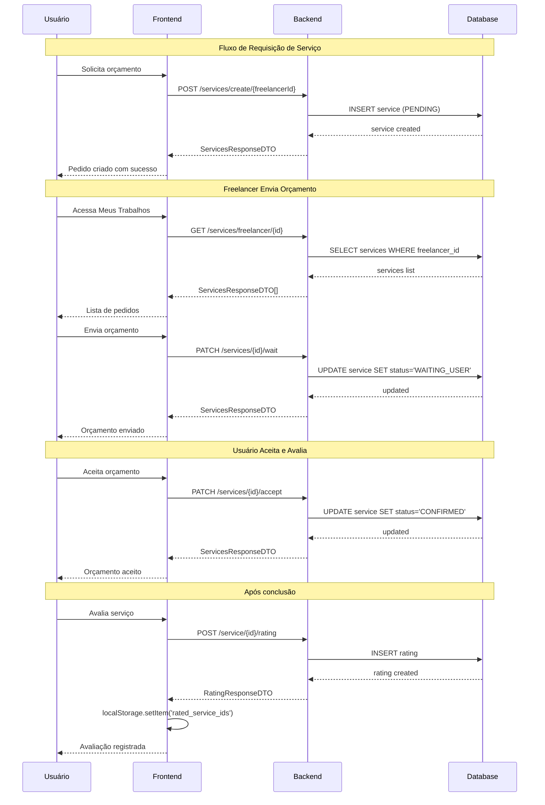

# 🔗 Documentação de Integração - Uma Mãozinha

## 📋 Índice
1. [Visão Geral](#visão-geral)
2. [Arquitetura da Aplicação](#arquitetura-da-aplicação)
3. [Fluxos Principais](#fluxos-principais)
4. [Endpoints da API](#endpoints-da-api)
5. [Modelos de Dados](#modelos-de-dados)
6. [Configuração e Deploy](#configuração-e-deploy)

---

## 🎯 Visão Geral

A aplicação **Uma Mãozinha** é uma plataforma de marketplace que conecta usuários a freelancers para prestação de serviços. A integração completa entre frontend (Angular) e backend (Spring Boot) garante um fluxo seguro e eficiente para todas as operações.

### Tecnologias Utilizadas

**Frontend:**
- Angular 19+ (Standalone Components)
- TypeScript
- Tailwind CSS
- RxJS para gerenciamento de estado
- JWT para autenticação

**Backend:**
- Spring Boot 3.x
- Spring Security com JWT
- JPA/Hibernate
- PostgreSQL
- Swagger/OpenAPI para documentação

---

## 🏗️ Arquitetura da Aplicação

### Estrutura do Frontend

```
src/app/
├── components/          # Componentes reutilizáveis
│   ├── rating-modal/
│   ├── request-service-modal/
│   ├── accept-budget-modal/
│   └── ...
├── pages/               # Páginas da aplicação
│   ├── register/
│   ├── login/
│   ├── my-requests/
│   ├── browse-services/
│   └── service-detail/
├── services/            # Serviços de comunicação com API
│   ├── auth.service.ts
│   ├── rating.service.ts
│   └── service-request-management.service.ts
└── models/              # Interfaces e DTOs
    ├── user.model.ts
    ├── rating.model.ts
    └── service-request.model.ts
```

### Estrutura do Backend

```
br/com/umamanzinha/uma_maozinha/
├── controller/          # Controllers REST
│   ├── LoginController
│   ├── UserController
│   ├── ServicesController
│   ├── RatingController
│   └── PublicRatingController
├── services/            # Lógica de negócio
│   ├── LoginService
│   ├── UserService
│   ├── ServicesService
│   └── RatingService
├── repository/          # Acesso a dados
├── dtos/                # Data Transfer Objects
└── config/              # Configurações de segurança
```

---

## 🔄 Fluxos Principais

### 1. Fluxo de Cadastro (Registro)

**Frontend → Backend**

1. **Usuário preenche formulário** (`register.component.ts`)
   - Nome, email, senha
   - Endereço (opcional)
   - Telefone (opcional)

2. **Validações no Frontend**
   - Senhas devem coincidir
   - Email deve ser válido
   - Campos obrigatórios preenchidos
   - Se endereço informado, todos os campos são obrigatórios

3. **Envio para Backend**
   ```typescript
   POST /api/users/create
   {
     name: string,
     email: string,
     password: string,
     addressDTO?: AddressDTO[],
     phoneDTO?: PhoneDTO[]
   }
   ```

4. **Backend processa** (`UserController.createUser()`)
   - Valida email único
   - Hash da senha
   - Cria usuário com role USER
   - Retorna UserDTO (201 Created)

5. **Frontend redireciona**
   - Usuário é levado para home ou returnUrl
   - Mensagem de sucesso exibida

---

### 2. Fluxo de Login

**Autenticação JWT**

1. **Usuário insere credenciais** (`login.component.ts`)
   ```typescript
   POST /api/login
   {
     email: string,
     password: string
   }
   ```

2. **Backend valida** (`LoginController.login()`)
   - Verifica credenciais
   - Gera JWT token com:
     - userId
     - name
     - email
     - roles (USER ou FREELANCER)
     - expiresIn

3. **Frontend armazena token** (`auth.service.ts`)
   - Token salvo em localStorage como 'authToken'
   - Token decodificado para extrair dados do usuário
   - Normalização de role:
     ```typescript
     // Detecta FREELANCER em roles[] ou isFreelancer=true
     if (roles.includes('FREELANCER') || payload.isFreelancer) {
       user.role = 'FREELANCER';
       user.isFreelancer = true;
     }
     ```

4. **Sincronização de perfil**
   - `refreshCurrentUser()` chamado após login
   - Atualiza dados completos do usuário
   - Navbar detecta isFreelancer e exibe "Meus Trabalhos"

5. **Interceptor adiciona token**
   - Todas as requisições subsequentes incluem:
     ```
     Authorization: Bearer <token>
     ```

---

### 3. Fluxo de Requisição de Serviço

**Ciclo completo: Pedido → Orçamento → Aceitação → Conclusão**

#### 3.1 Criação do Pedido

1. **Usuário visualiza perfil do freelancer**
   - Clica em "Solicitar Orçamento"
   - Modal abre (`request-service-modal.component`)

2. **Preenche dados do pedido**
   - Descrição detalhada
   - Preço proposto
   - Localização

3. **Frontend envia pedido**
   ```typescript
   POST /api/services/create/{freelancerProfileId}
   {
     description: string,
     price: number,
     location: string,
     createdAt: string,
     userId: number
   }
   ```

4. **Backend cria serviço** (`ServicesController.createService()`)
   - Status inicial: **PENDING**
   - Associa ao usuário e freelancer
   - Retorna ServicesResponseDTO (201)

#### 3.2 Freelancer Envia Orçamento

1. **Freelancer acessa "Meus Trabalhos"**
   - Vê pedidos com status PENDING
   - Clica em "Enviar Contraproposta"

2. **Frontend envia orçamento**
   ```typescript
   PATCH /api/services/{serviceId}/wait
   {
     price: number,
     description: string
   }
   ```

3. **Backend atualiza status**
   - Status: PENDING → **WAITING_USER**
   - Preço e descrição atualizados

#### 3.3 Usuário Aceita Orçamento

1. **Usuário vê orçamento em "Meus Pedidos"**
   - Status WAITING_USER
   - Clica em "Aceitar Orçamento"
   - Modal solicita telefone (obrigatório WhatsApp)

2. **Frontend envia aceitação**
   ```typescript
   PATCH /api/services/{serviceId}/accept
   {
     phoneId: number
   }
   ```

3. **Backend confirma**
   - Status: WAITING_USER → **CONFIRMED**
   - Telefone associado ao serviço

#### 3.4 Conclusão do Serviço

1. **Freelancer marca como concluído**
   ```typescript
   PATCH /api/services/{serviceId}/complete
   ```

2. **Backend finaliza**
   - Status: CONFIRMED → **COMPLETED**
   - Serviço disponível para avaliação

#### 3.5 Estados de Transição

```
PENDING → WAITING_USER → CONFIRMED → COMPLETED
    ↓           ↓            ↓
CANCELLED   CANCELLED    CANCELLED
```

---

### 4. Fluxo de Avaliação (Rating)

**Sistema de avaliação com persistência**

#### 4.1 Criação da Avaliação

1. **Requisitos para avaliar**
   - Serviço deve estar com status **COMPLETED**
   - Apenas o **dono do serviço** pode avaliar
   - Cada serviço pode ter **apenas UMA avaliação**

2. **Usuário acessa "Meus Pedidos"**
   - Vê serviços concluídos
   - Botão "⭐ Avaliar Serviço" aparece

3. **Modal de avaliação abre** (`rating-modal.component`)
   - Seleção de 1-5 estrelas (obrigatório)
   - Comentário opcional (max 500 caracteres)

4. **Frontend envia avaliação**
   ```typescript
   POST /api/service/{serviceId}/rating
   {
     score: number,        // 1-5
     comment?: string
   }
   ```

5. **Backend valida e cria** (`RatingController.createRating()`)
   - Verifica se serviço está COMPLETED
   - Verifica se usuário é o dono
   - Verifica se já existe avaliação
   - Retorna RatingResponseDTO (201)

#### 4.2 Persistência no Frontend

1. **localStorage tracking**
   ```typescript
   // Chave: 'rated_service_ids'
   // Valor: [12, 34, 56] // Array de IDs
   ```

2. **Sincronização com backend**
   - Ao carregar "Meus Pedidos":
     ```typescript
     GET /api/users/{userId}/ratings
     ```
   - Extrai IDs dos serviços avaliados
   - Salva em localStorage
   - Botão "Avaliar" desaparece para serviços já avaliados

#### 4.3 Exibição das Avaliações

1. **Perfil do Freelancer** (`service-detail.component`)
   ```typescript
   GET /api/freelancer/{freelancerId}/ratings
   ```
   - Endpoint público (sem autenticação)
   - Retorna array de avaliações
   - Calcula média e total

2. **Card de Serviço** (`service-card.component`)
   - Busca contagem de avaliações
   - Exibe: "⭐ 4.8 (12 avaliações)"

3. **Componente de Exibição** (`rating-display.component`)
   - Lista completa de avaliações
   - Mostra: score, comentário, data
   - Calcula e exibe média geral

---

## 🌐 Endpoints da API

### Autenticação

| Método | Endpoint | Descrição | Auth |
|--------|----------|-----------|------|
| POST | `/api/login` | Login com email/senha | ❌ |
| POST | `/api/users/create` | Cadastro de novo usuário | ❌ |

**Exemplo Login:**
```json
Request:
POST /api/login
{
  "email": "user@example.com",
  "password": "senha123"
}

Response: 200 OK
{
  "token": "eyJhbGciOiJIUzI1NiIs...",
  "expiresIn": 3600000
}
```

---

### Usuários

| Método | Endpoint | Descrição | Auth |
|--------|----------|-----------|------|
| GET | `/api/users/{id}` | Buscar usuário por ID | ✅ |
| GET | `/api/users` | Listar todos usuários | ✅ |
| PUT | `/api/users/{id}` | Atualizar usuário | ✅ |
| DELETE | `/api/users/{id}` | Deletar usuário | ✅ |
| GET | `/api/users/{userId}/ratings` | Avaliações do usuário | ✅ |

---

### Serviços (Pedidos)

| Método | Endpoint | Descrição | Auth | Role |
|--------|----------|-----------|------|------|
| POST | `/api/services/create/{freelancerId}` | Criar pedido | ✅ | USER |
| GET | `/api/services/user/{userId}` | Pedidos do usuário | ✅ | USER/FREELANCER |
| GET | `/api/services/freelancer/{id}` | Pedidos do freelancer | ✅ | FREELANCER |
| PATCH | `/api/services/{id}/confirm` | Confirmar pedido | ✅ | FREELANCER |
| PATCH | `/api/services/{id}/wait` | Enviar orçamento | ✅ | FREELANCER |
| PATCH | `/api/services/{id}/accept` | Aceitar orçamento | ✅ | USER |
| PATCH | `/api/services/{id}/complete` | Concluir serviço | ✅ | FREELANCER |
| PATCH | `/api/services/{id}/cancel` | Cancelar serviço | ✅ | USER/FREELANCER |

**Exemplo - Criar Pedido:**
```json
Request:
POST /api/services/create/5
Authorization: Bearer <token>
{
  "description": "Preciso de um site institucional com 5 páginas",
  "price": 1500.00,
  "location": "São Paulo, SP",
  "createdAt": "2025-12-09T10:00:00",
  "userId": 12
}

Response: 201 Created
{
  "id": 100,
  "description": "Preciso de um site institucional...",
  "status": "PENDING",
  "price": 1500.00,
  "location": "São Paulo, SP",
  "user": {
    "id": 12,
    "name": "João Silva"
  },
  "freelancer": {
    "id": 5,
    "title": "Desenvolvedor Web",
    "user": {
      "id": 8,
      "name": "Maria Santos"
    }
  },
  "createdAt": "2025-12-09T10:00:00"
}
```

**Exemplo - Enviar Orçamento:**
```json
Request:
PATCH /api/services/100/wait
Authorization: Bearer <token>
{
  "price": 1800.00,
  "description": "Orçamento atualizado com recursos adicionais"
}

Response: 200 OK
{
  "id": 100,
  "status": "WAITING_USER",
  "price": 1800.00,
  ...
}
```

---

### Avaliações (Ratings)

| Método | Endpoint | Descrição | Auth |
|--------|----------|-----------|------|
| POST | `/api/service/{serviceId}/rating` | Criar avaliação | ✅ |
| PATCH | `/api/service/{serviceId}/rating/{ratingId}` | Atualizar avaliação | ✅ |
| DELETE | `/api/service/{serviceId}/rating/{ratingId}` | Deletar avaliação | ✅ |
| GET | `/api/freelancer/{freelancerId}/ratings` | Avaliações do freelancer | ❌ |
| GET | `/api/users/{userId}/ratings` | Minhas avaliações | ✅ |

**Exemplo - Criar Avaliação:**
```json
Request:
POST /api/service/100/rating
Authorization: Bearer <token>
{
  "score": 5,
  "comment": "Excelente trabalho! Muito profissional e entregue no prazo."
}

Response: 201 Created
{
  "id": 50,
  "score": 5,
  "comment": "Excelente trabalho! Muito profissional e entregue no prazo.",
  "servicesDTO": {
    "id": 100,
    "description": "...",
    ...
  },
  "createdAt": "2025-12-09T15:30:00"
}
```

**Exemplo - Buscar Avaliações de Freelancer:**
```json
Request:
GET /api/freelancer/5/ratings

Response: 200 OK
[
  {
    "id": 50,
    "score": 5,
    "comment": "Excelente trabalho!",
    "servicesDTO": { ... },
    "createdAt": "2025-12-09T15:30:00"
  },
  {
    "id": 48,
    "score": 4,
    "comment": "Muito bom!",
    "servicesDTO": { ... },
    "createdAt": "2025-12-08T10:20:00"
  }
]
```

---

## 📦 Modelos de Dados

### UserDTO
```typescript
{
  id: number,
  name: string,
  email: string,
  password?: string,        // Somente no cadastro
  role: 'USER' | 'FREELANCER',
  isFreelancer?: boolean,
  addressDTO?: AddressDTO[],
  phoneDTO?: PhoneDTO[]
}
```

### AddressDTO
```typescript
{
  id: number,
  street: string,
  city: string,
  state: string,
  zipCode: string,
  country: string
}
```

### PhoneDTO
```typescript
{
  id: number,
  number: string,
  isWhatsApp: boolean,
  description?: string
}
```

### ServicesRequestDTO
```typescript
{
  description: string,
  price: number,
  location: string,
  createdAt: string,
  userId: number
}
```

### ServicesResponseDTO
```typescript
{
  id: number,
  description: string,
  status: ServiceRequestStatus,
  price: number,
  location: string,
  user: {
    id: number,
    name: string
  },
  freelancer: {
    id: number,
    title: string,
    user: {
      id: number,
      name: string
    }
  },
  phone?: PhoneDTO,
  createdAt: string
}
```

### ServiceRequestStatus (Enum)
```typescript
enum ServiceRequestStatus {
  PENDING = 'PENDING',              // Aguardando orçamento do freelancer
  WAITING_USER = 'WAITING_USER',    // Aguardando aceitação do usuário
  CONFIRMED = 'CONFIRMED',          // Orçamento aceito, serviço em andamento
  COMPLETED = 'COMPLETED',          // Serviço concluído
  CANCELLED = 'CANCELLED'           // Serviço cancelado
}
```

### RatingRequestDTO
```typescript
{
  score: number,        // 1-5
  comment?: string      // Opcional, max 500 caracteres
}
```

### RatingResponseDTO
```typescript
{
  id: number,
  score: number,
  comment?: string,
  servicesDTO: ServicesResponseDTO,
  createdAt: string
}
```

---

## ⚙️ Configuração e Deploy

### Configuração do Frontend

1. **Proxy Configuration** (`proxy.conf.json`)
   ```json
   {
     "/api": {
       "target": "http://localhost:8080",
       "secure": false,
       "changeOrigin": true
     }
   }
   ```

2. **Executar em Desenvolvimento**
   ```bash
   cd projeto/frontend-angular
   npm install
   ng serve --proxy-config proxy.conf.json
   ```

3. **Build de Produção**
   ```bash
   ng build --configuration production
   ```

### Configuração do Backend

1. **application.yml**
   ```yaml
   spring:
     datasource:
       url: jdbc:postgresql://localhost:5432/umamaozinha
       username: postgres
       password: ${DB_PASSWORD}
     jpa:
       hibernate:
         ddl-auto: update
   
   jwt:
     secret: ${JWT_SECRET}
     expiration: 3600000  # 1 hora
   ```

2. **Executar em Desenvolvimento**
   ```bash
   cd app-uma-maozinha-backend/uma-maozinha
   mvn spring-boot:run
   ```

3. **Build de Produção**
   ```bash
   mvn clean package
   java -jar target/uma-maozinha-0.0.1-SNAPSHOT.jar
   ```

### Docker Compose (Produção)

```yaml
version: '3.8'

services:
  postgres:
    image: postgres:15
    environment:
      POSTGRES_DB: umamaozinha
      POSTGRES_USER: postgres
      POSTGRES_PASSWORD: ${DB_PASSWORD}
    ports:
      - "5432:5432"
    volumes:
      - postgres_data:/var/lib/postgresql/data

  backend:
    build: ./app-uma-maozinha-backend
    ports:
      - "8080:8080"
    environment:
      SPRING_DATASOURCE_URL: jdbc:postgresql://postgres:5432/umamaozinha
      JWT_SECRET: ${JWT_SECRET}
    depends_on:
      - postgres

  frontend:
    build: ./projeto/frontend-angular
    ports:
      - "80:80"
    depends_on:
      - backend

volumes:
  postgres_data:
```

---

## 🔐 Segurança

### Autenticação JWT

1. **Token Generation**
   - Gerado no login com validade de 1 hora
   - Contém: userId, name, email, roles

2. **Token Validation**
   - Interceptor adiciona header Authorization
   - Backend valida em cada requisição
   - `@PreAuthorize` protege endpoints por role

3. **Refresh Token**
   - Frontend chama `refreshCurrentUser()` após login
   - Mantém dados sincronizados

### Autorização por Role

```java
@PreAuthorize("hasRole('FREELANCER')")
public ResponseEntity<?> freelancerOnlyEndpoint() { ... }

@PreAuthorize("hasAnyRole('USER', 'FREELANCER')")
public ResponseEntity<?> authenticatedEndpoint() { ... }
```

### Validações de Negócio

1. **Criação de Avaliação**
   - Serviço deve estar COMPLETED
   - Usuário deve ser o dono do serviço
   - Não pode haver avaliação duplicada

2. **Aceitação de Orçamento**
   - Status deve ser WAITING_USER
   - Telefone WhatsApp obrigatório
   - Usuário deve ser o dono do pedido

3. **Cancelamento de Serviço**
   - Não pode cancelar se COMPLETED
   - Apenas dono pode cancelar

---

## 📊 Fluxo de Dados Completo



---

## 🎨 Características da Integração

### ✅ Implementado

1. **Autenticação Completa**
   - Login com JWT
   - Cadastro com validações
   - Refresh de token
   - Role-based access control

2. **Gestão de Serviços**
   - Criação de pedidos
   - Envio de orçamentos
   - Aceitação com telefone
   - Conclusão e cancelamento
   - Estados de transição validados

3. **Sistema de Avaliações**
   - Modal de criação
   - Validações de negócio
   - Persistência localStorage
   - Sincronização com backend
   - Exibição em perfis

4. **Navegação Inteligente**
   - Filtros de categoria funcionais
   - Busca por texto
   - returnUrl após login
   - Navbar dinâmica por role

5. **Responsividade**
   - Mobile-first design
   - Sidebar colapsável
   - Modais responsivos
   - Grid adaptativo

---

## 🐛 Tratamento de Erros

### Frontend

```typescript
// Padrão de tratamento
this.service.method().subscribe({
  next: (response) => {
    // Sucesso
    this.success = 'Operação realizada com sucesso';
  },
  error: (err) => {
    // Erro
    console.error('Erro:', err);
    this.error = err.error?.detail || 'Erro ao processar. Tente novamente.';
  }
});
```

### Backend

```java
@RestControllerAdvice
public class GlobalExceptionHandler {
    
    @ExceptionHandler(ResourceNotFoundException.class)
    public ResponseEntity<ErrorResponse> handleNotFound(ResourceNotFoundException ex) {
        return ResponseEntity
            .status(HttpStatus.NOT_FOUND)
            .body(new ErrorResponse(ex.getMessage()));
    }
    
    @ExceptionHandler(BusinessRuleException.class)
    public ResponseEntity<ErrorResponse> handleBusinessRule(BusinessRuleException ex) {
        return ResponseEntity
            .status(HttpStatus.BAD_REQUEST)
            .body(new ErrorResponse(ex.getMessage()));
    }
}
```

---

## 📈 Melhorias Futuras

### Curto Prazo
- [ ] Notificações em tempo real (WebSocket)
- [ ] Upload de imagens de perfil
- [ ] Chat entre usuário e freelancer
- [ ] Sistema de busca avançada com filtros

### Médio Prazo
- [ ] Pagamento integrado
- [ ] Sistema de disputa
- [ ] Certificações de freelancers
- [ ] Histórico de transações

### Longo Prazo
- [ ] App mobile (React Native)
- [ ] Sistema de recomendação (ML)
- [ ] API pública para integrações
- [ ] Dashboard administrativo

---

## 📞 Suporte

Para dúvidas ou problemas com a integração:

- **Documentação da API:** http://localhost:8080/swagger-ui.html
- **Repository:** https://github.com/Henio200025/projeto

---

**Última atualização:** 9 de dezembro de 2025
**Versão:** 1.0.0
